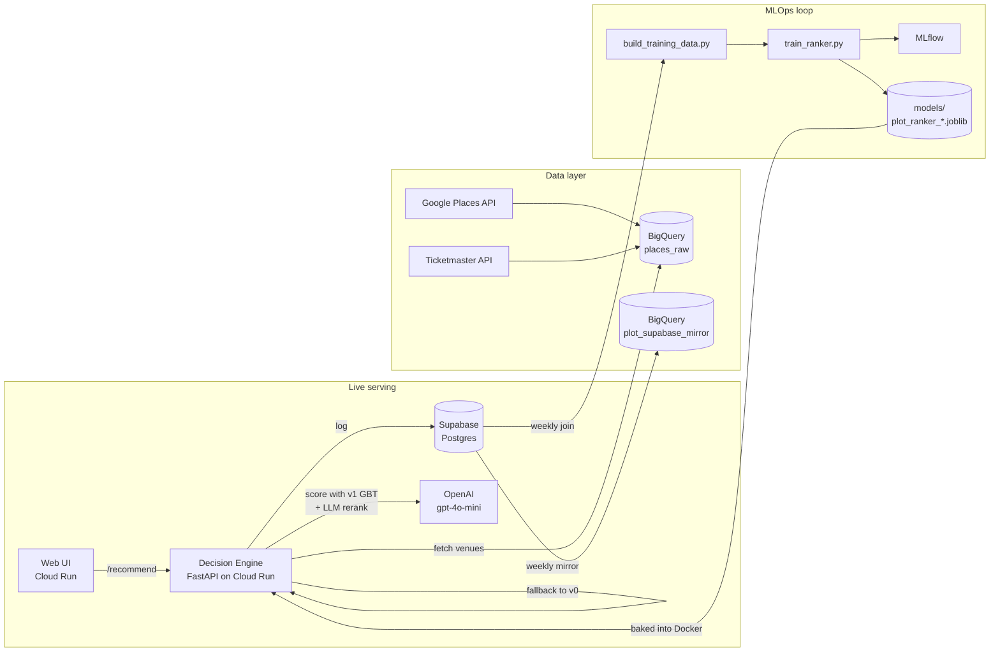

# Plot

Group hangout planner for San Francisco. Two or more people pick their preferences (budget, categories, distance, vibe) — Plot merges them and recommends ranked venues + events from live data.

Built as an end-to-end **MLOps prototype**: data scraping → training → serving with model + LLM rerank → feedback loop → automated weekly retrain → monitoring + backup.

---

## Plot demo

https://github.com/user-attachments/assets/5f21561c-dff5-48d1-b652-23974b1b6329

---

## Try it live

| Service | URL |
|---|---|
| **Web app** | https://plot-ui-773940296505.us-central1.run.app |
| **API** | https://plot-decision-engine-773940296505.us-central1.run.app |
| **API health** | [`/health`](https://plot-decision-engine-773940296505.us-central1.run.app/health) |
| **Cost dashboard** | `/admin/llm-cost?days=7` |

Both services run on Google Cloud Run (`min=1` instance, no cold starts; rate-limited 100 req/min/IP).

---

## Architecture



The trained ranker (sklearn GradientBoosting) loads at API startup, scores candidates, and the LLM reranks the top-20 with gpt-4o-mini. Both layers fall back gracefully — if the model file is missing, v0 heuristic ranks; if OpenAI 429s, v0 ranks.

---

## What's actually there (every box ticked)

| Layer | Implementation |
|---|---|
| **Data scraping** | Google Places + Ticketmaster → BigQuery, automated via Cloud Run Jobs + Cloud Scheduler. Manual fallback workflows in `.github/workflows/scrape_*.yml` |
| **Storage** | Supabase Postgres for users, groups, recommendation_log, feedback, group_votes. `db.py` is plain SQL — swap `DATABASE_URL` to migrate |
| **API** | FastAPI on Cloud Run. Endpoints: `/recommend`, `/feedback`, `/events`, `/parse`, `/groups/*`, `/admin/llm-cost`, `/health` |
| **Trained ranker** | `sklearn.GradientBoostingClassifier` trained on real `feedback` rows. Serves at request time via `ranker.py`. `model_version` stamped on every recommendation_log row for A/B comparison |
| **LLM rerank** | gpt-4o-mini reranks v0 top-20 with per-venue reasons (≈$0.0005/call). Prompt versioning via `prompt_version` field |
| **LLM intent parser** | `/parse` turns free text ("chill cocktail night") into structured prefs |
| **Retrain pipeline** | Mondays 07:00 UTC. `build_training_data.py` → Supabase join → `train_ranker.py` → MLflow log → GitHub Release with new `.joblib`. Promotion is manual (drop new artifact in `models/` + redeploy) so a bad week doesn't ship to prod |
| **Cost monitoring** | `GET /admin/llm-cost?days=7` returns total, p50/p95 latency, daily series, breakdown by `model_version` |
| **Backup + analytics** | Mondays 08:00 UTC: weekly Supabase → BigQuery mirror so the same SQL workflow can query user data alongside scraped data |
| **CI/CD** | GitHub Actions: ruff lint + 88 tests on every push, blocked on red. `gcloud builds submit` deploys via Cloud Build |
| **Demo hardening** | 100 req/min/IP rate limit (FastAPI Depends, in-memory sliding window), Cloud Run `min=1 / max=50` for no cold starts and surge headroom |

---

## Tech stack

**Backend** Python 3.11, FastAPI, Pydantic v2, psycopg2 · **Frontend** React 18 (loaded via Babel standalone — no build step), DM Sans + Bricolage Grotesque · **ML** scikit-learn, pandas, MLflow · **LLM** OpenAI gpt-4o-mini · **Data** Google BigQuery, Supabase Postgres · **Deploy** Google Cloud Run, Artifact Registry, Cloud Build · **CI** GitHub Actions, ruff, pytest, pre-commit

---

## Repo layout

| Path | Purpose |
|------|---------|
| [decision_engine.py](decision_engine.py) | FastAPI service — preference merging, scoring, LLM rerank wiring, all endpoints |
| [ranker.py](ranker.py) | Loads trained `.joblib` at startup, scores candidates, falls back to v0 if missing |
| [llm_rerank.py](llm_rerank.py) | gpt-4o-mini reranker with full v0 fallback |
| [llm_intent.py](llm_intent.py) | Free-text → structured prefs for `/parse` |
| [recommendation_bigquery.py](recommendation_bigquery.py) | BigQuery fetchers for venues + events |
| [db.py](db.py) | Supabase layer (raw SQL via psycopg2) |
| [build_training_data.py](build_training_data.py) | Joins recommendation_log ⨝ feedback → CSV |
| [notebooks/train_ranker.py](notebooks/train_ranker.py) | Trains GBT ranker with NDCG@5 vs v0 baseline, logs to MLflow |
| [categories.py](categories.py) | Single source of truth for the 10 canonical categories |
| [prompts/](prompts/) | Versioned LLM prompt templates (`rerank_v1.txt`, `parse_intent_v1.txt`) |
| [UI/](UI/) | React app — chip-based prefs, group lobby, recs, voting, memories |
| [Data_scraping/](Data_scraping%20/) | Google Places + Ticketmaster → BigQuery pipelines |
| [scripts/](scripts/) | Idempotent Cloud Run setup scripts + Supabase→BQ mirror |
| [tests/](tests/) | 88 tests — unit, mocked-integration, opt-in live |
| [.github/workflows/](.github/workflows/) | CI, weekly retrain, weekly Supabase→BQ mirror, scraper fallbacks |
| [INFRASTRUCTURE.md](INFRASTRUCTURE.md) | System design, GCP cost model, deployment philosophy |

---

## Quick start

```bash
# 1. Setup
git clone git@github.com:saisri27/Plot_MLops.git
cd Plot_MLops
conda create -n plot python=3.11 -y && conda activate plot
pip install -r requirements.txt
pre-commit install

# 2. Credentials
cp "Data_scraping /.env.example" .env
# Fill in: GCP_PROJECT, DATABASE_URL, OPENAI_API_KEY, GOOGLE_PLACES_API_KEY, TICKETMASTER_API_KEY
gcloud auth application-default login    # for BigQuery reads

# 3. Run the API
uvicorn decision_engine:app --reload --port 8080
curl http://127.0.0.1:8080/health

# 4. Run the UI (separate terminal)
cd UI && python3 -m http.server 5500
# open http://127.0.0.1:5500/Plot.html
```

If `/recommend` returns 503 with a BigQuery error, you skipped step 2's ADC login.

If `OPENAI_API_KEY` isn't set, `/recommend` silently falls back to the trained ranker (or v0 heuristic) with no LLM reasons — the demo still works.

---

## Testing

```bash
# Full suite, mocked live deps (matches CI)
pytest tests/ -v -m "not live"

# Lint + format
ruff check . && ruff format --check .

# Live OpenAI test (needs key)
pytest tests/test_llm_rerank.py -v -m live

# BigQuery integration (needs ADC)
RUN_BQ_INTEGRATION=1 pytest tests/test_bigquery_integration.py -v
```

**88 tests total** — unit (43), mocked integration (40), live (5). CI runs the non-live subset on every push.

---

## Deployment

```bash
# API (rebuilds Docker image with the latest model in models/)
source .env && bash scripts/setup_cloud_run_api.sh

# UI
bash scripts/setup_cloud_run_ui.sh

# Scrapers (Cloud Run Jobs + Cloud Scheduler)
source .env && bash scripts/setup_cloud_run_jobs.sh
```

All deploy scripts are idempotent — re-run after any code change to roll out a new revision. The API URL stays stable across revisions.

---

## License

MIT. See [LICENSE](LICENSE) if present, otherwise this is a class-project prototype shared for educational reference.

---

Built for the MSDS-694 / 698 MLOps course. See [INFRASTRUCTURE.md](INFRASTRUCTURE.md) for the full system-design doc and cost justification.
